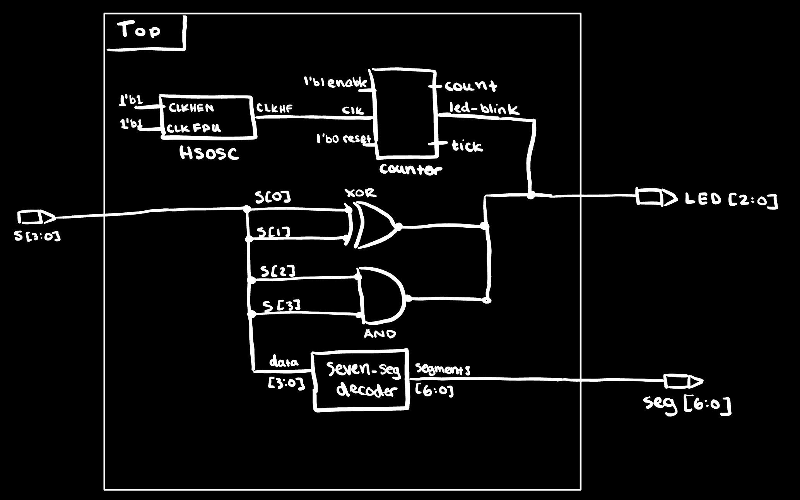
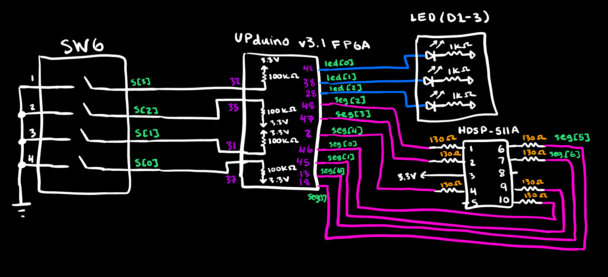
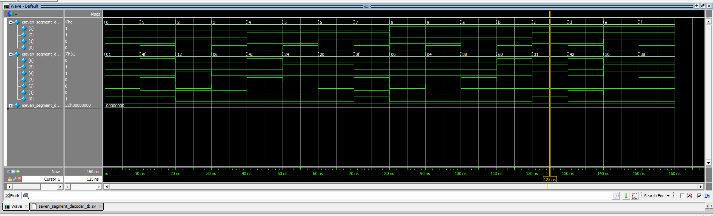
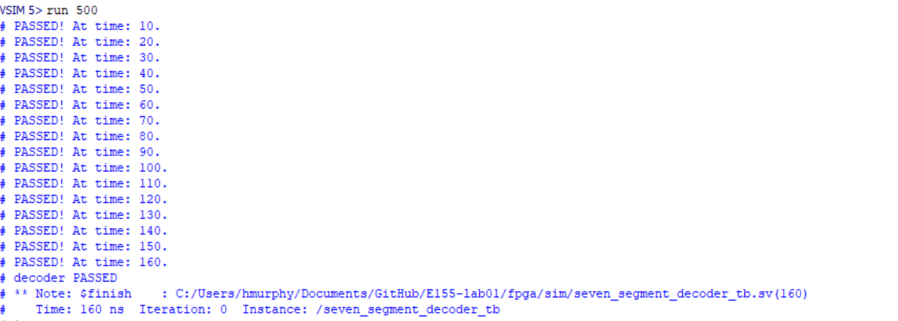
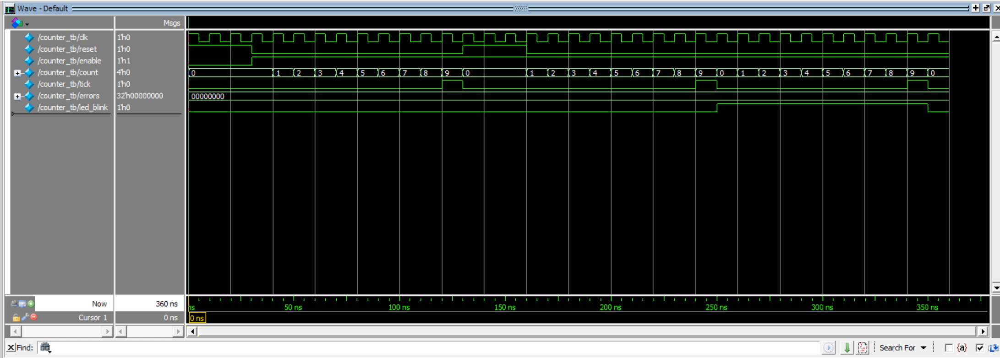
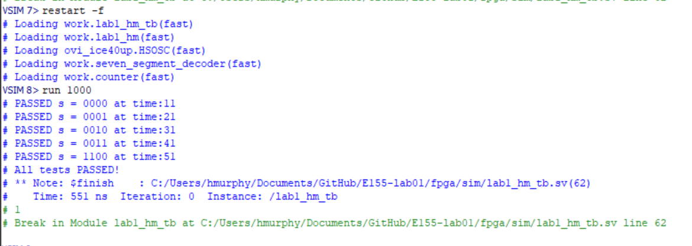
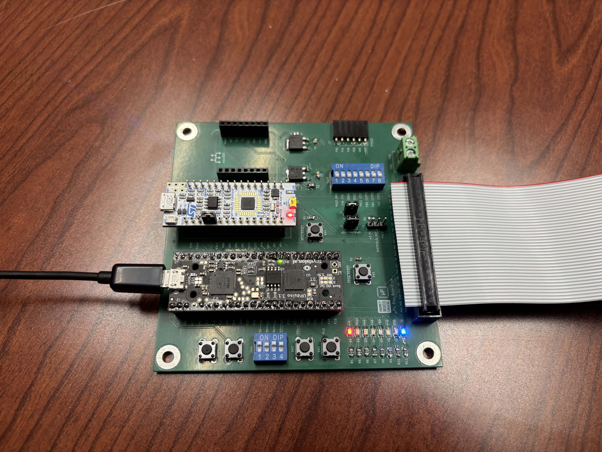
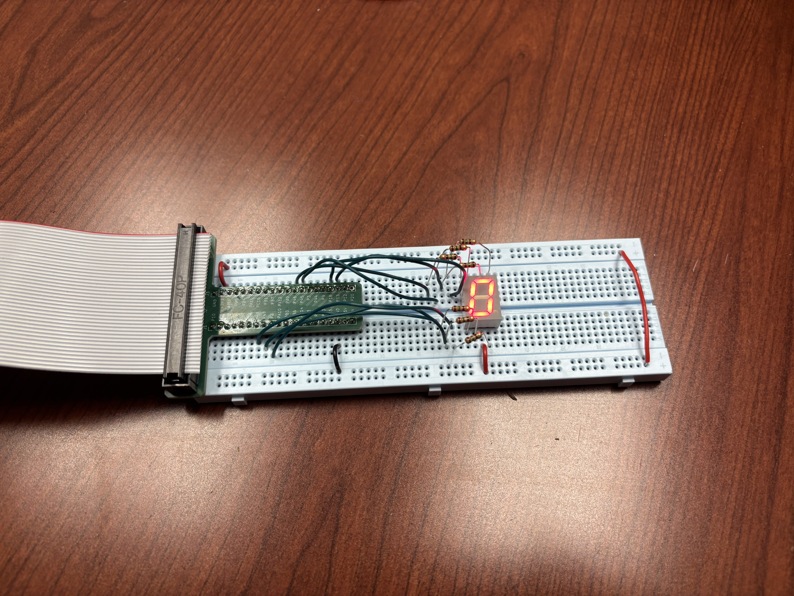

## Introduction:
Lab 1 focused on the introduction of the E155 development board (which integrates both a UPduino v3.1, equipped with a iCE40 UP5K FPGA, and an STM32 Nucleo microcontroller). The primary goals of the lab were to assemble both the board and all hardware associated with it, confirming functionality in addition to writing verilog to drive a 7-segment LED display using just the FPGA and DIP switches with a requirement to model the design in QuestaSim prior to programming the board. Furthermore, the lab also required 

## Design and Testing Methodology:
::: {.callout-note}
All SMT and THT components were soldered onto the E155 development board are were examined using a mulitmeter to confrim connectivity, as well as functional resistance and capacitance values. The board was then powered on to assess the functionality of the onboard LEDs, and DIP switches using provided source code to initialize and confirm the ability to program the onboard FPGA and MCU. 
::: 

Once the physical hardware was assenbled, the overall design of the projeck was broken down into threemodules (two submodules plus a top-level module): 'seven_segment_decoder.sv', 'counter.sv', and 'lab1_hm.sv'. 

- The 'seven_segment_decoder.sv' module was responsible for implementing combinational logic to convert a 4-bit binary input from a set of DIP switches (SW6) into the appropriate 7-segment display output. 

- The 'counter.sv' module implemented a simple counter that incremented based on the internal clock signal derived from the on-board high-speed oscillator (HSOSC) onboard the iCE40. Given the HSOSC was configured to operate at 48MHz, the counter was used to divide the clock signal down to a frequency of 2.4Hz to drive a flashing LED (led2) on the board.
- the 'lab1_hm.sv' top-level module integrated both submodules, managing the overall functionality of the design as well as test two types of combitinational logic (AND & XOR) using the same input set of DIP switches to control and additional two seperate LEDs (led0 and led1). 

::: {.callout-note}
Each module had its own testbench to selfcheck the functionality of the respective module using a series of assert statements to validate the expected output of each module in addition to producing waveforms that could be analyzed to confirm expected behavior of the design.
:::

### Technical Documentation:
The source code for the project can be found in the '/labs/lab1/fpga/radiant project' directory in the associated [GitHub repository](https://github.com/hlmurphy/e155-portfolio).

### Block Diagram
{#fig-block width=80%}

The top module wires four elements together: the on-chip HSOSC (clock source), the combinational decoder (driven by switches), the parameterized counter (driven by HSOSC), and two combinational `assign` statements for `led[0]` and `led[1]`.

{#fig-schematic width=80%}

::: {.callout-note}
Signal names in the schematic are highlighted in green to indicate the corresponding FPGA GPIO pin assignment.
::: 

## Calculations

### Current Limiting Resistor Calculation
[Resistor Calculation - given a Vf of 2.0 V and a desired current of 7mA, we calculate 130 Ω as our effective resistnace. However, due to the lab supplies, we will use a 150 Ω resistor.](images/resistor_calcs.png){#fig-resistor-calcs width=60%}

### Clock Divider Calculation
[Clock cycle calculation - since HSOSC runs at 48 MHz and we want a 2.4 Hz output, we as 4.8 cycles per blink thus the MAX number of clock signals per cycle can only be 9,999,999.](images/clock_calcs.png){#fig-clock-calcs}

## Results and Discussion
### Decoder Simulation
All 16 hex values exercised, all assertions passed.

{#fig-decoder-wave}

{#fig-decoder-console}

### Counter Simulation

{#fig-counter-wave}

### Top-level Simulation
All five combinational assertions passed; 'dut.clk' visibly toggles at 48 MHz throughout, confirming HSOSC operation; 'led[2]' is demonstrated to blink throughout the simulation.

![Top-level waveform — switch changes propagate to 'led[0]', 'led[1]', and 'seg'; 'led[2]' blinks from the HSOSC-driven counter.](images/screenshots/top_module_waveforms.png){#fig-top-wave}

{#fig-top-console}

### On-Board Verification
{#fig-onboard width=80%}
{#fig-onboard width=80%}

## Summary & Conclusion

The design meets all functional requirements: switches map to led[0] (XOR), led[1] (AND), and a 7-segment hex-format display; led[2] blinks at 2.4 Hz driven by the on-chip 48 MHz oscillator through a parameterized divider. All three testbenches pass with self-checking assertions, and the design was successfully programmed to the UPduino using openFPGA.

::: {.callout-tip title="Compliance"}
This submission meets every requirement in the Lab 1 spec in addition to all "Excellence-rubric items": parameterized counter, exhaustive decoder testbench, feature-oriented counter testbench, and top-level testbench covering HSOSC, wiring, and 'assign' logic.
:::

### Hours spent

- Assembly and smoke test:  h
- Verilog design and synthesis: h
- QuestaSim setup and simulation debugging: h
- Report writeup, block diagram, and schematic: h
- **Total:  hours**
## AI Prototype Summary

