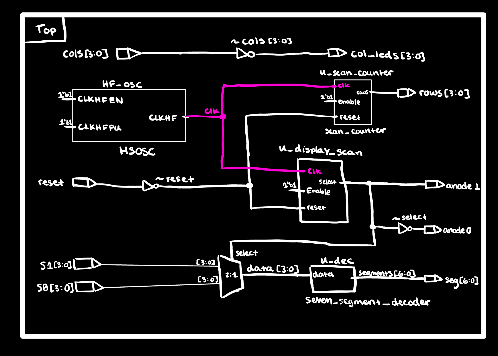
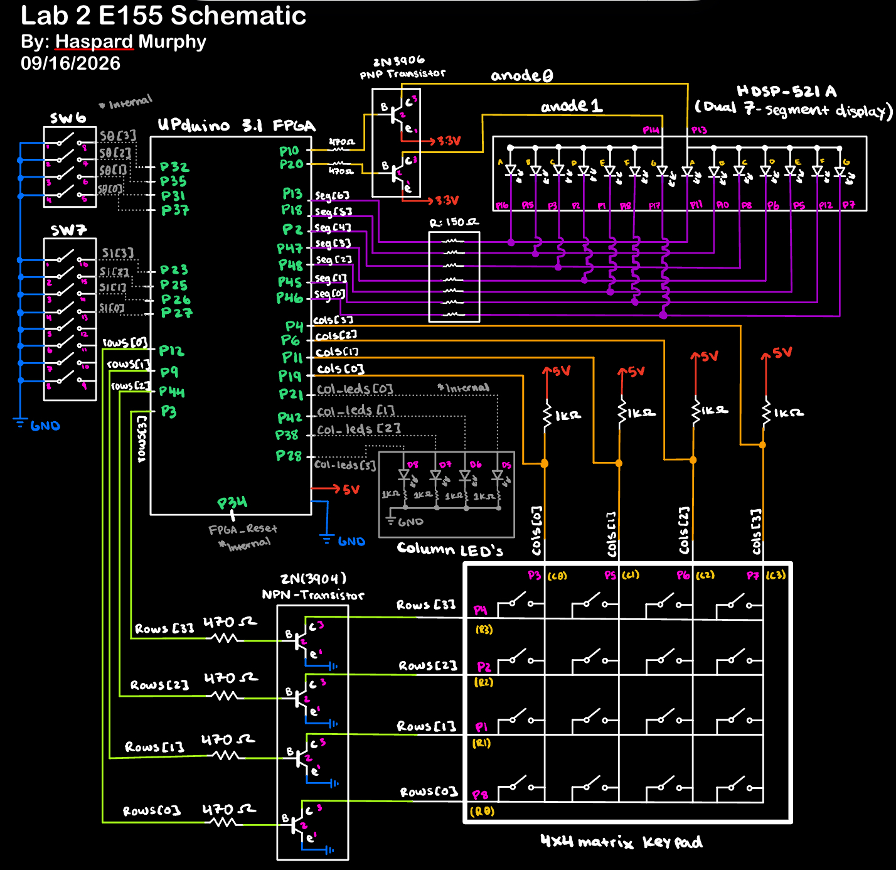
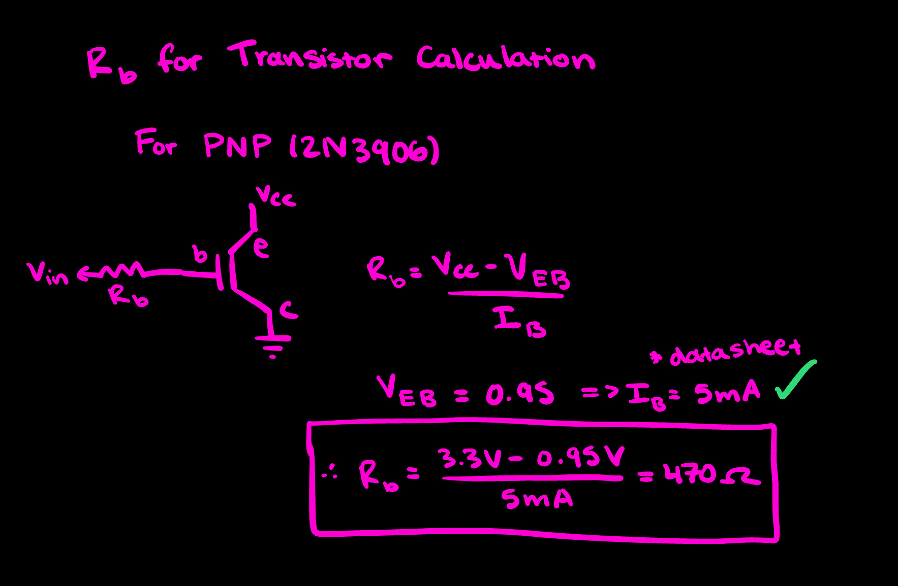
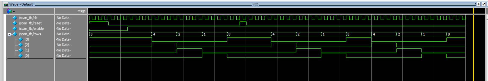
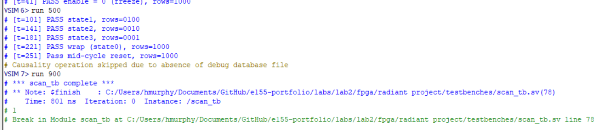
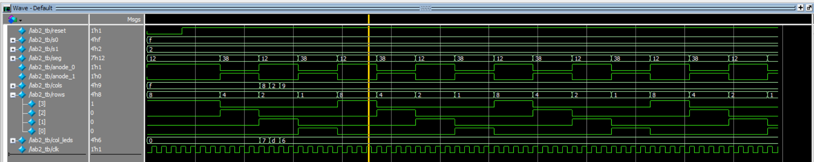
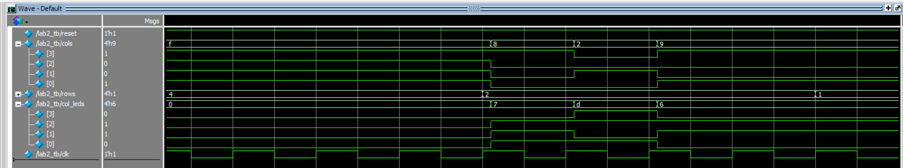
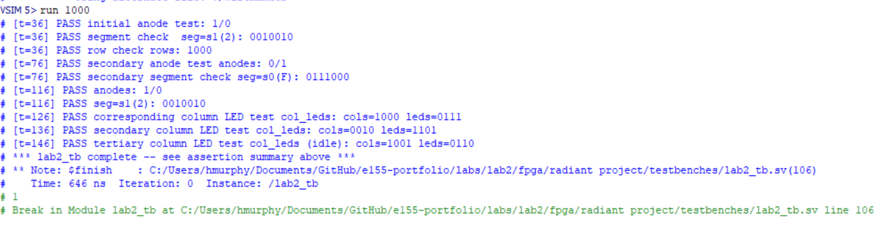
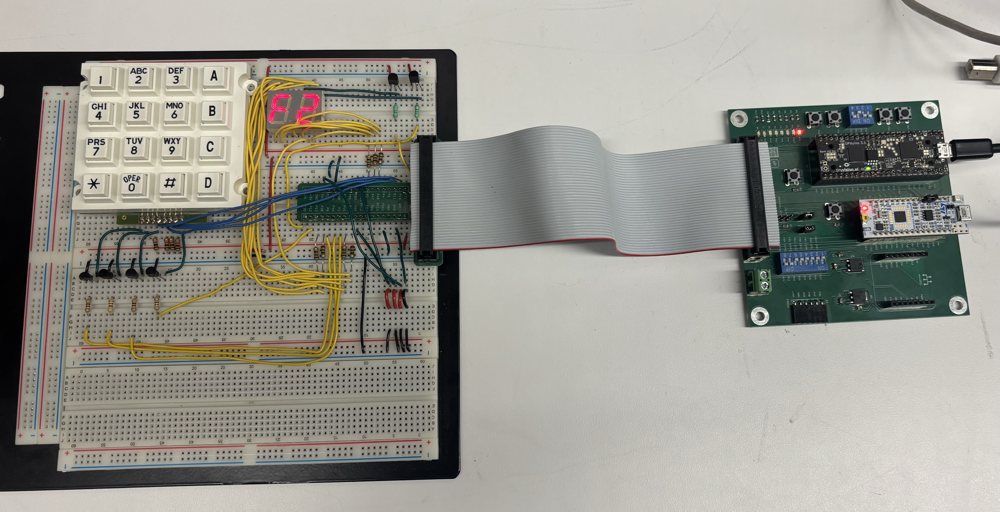

## Introduction:
To do

## Design and Testing Methodology:
::: {.callout-note}
To Do  
::: 

To Do

::: {.callout-note}
Each module had its own testbench to self-check the functionality of the respective module using a series of assert statements to validate the expected output of each module (modules resued from previous labs were validated agasint their repsectively created testbenches).
:::

### Technical Documentation:
The source code for the project can be found in the '/labs/lab1/fpga/radiant_project' directory in the associated [GitHub repository](https://github.com/hlmurphy/e155-portfolio).

### Block Diagram
{#fig-block width=80%}

The top module wires four elements together: the on-chip HSOSC (clock source), the combinational decoder (driven by switches), the parameterized counter (driven by HSOSC), and two combinational `assign` statements for `led[0]` and `led[1]`.

{#fig-schematic width=80%}

::: {.callout-tip title="Schematic Notation"}
Signal names in the schematic are highlighted in green to indicate the corresponding FPGA GPIO pin assignment.
::: 

## Calculations

### Current Limiting Resistor for PNP and NPN Transistor Calculation
{#fig-resistor-calcs width=60%}

## Results and Discussion
### Scan_Counter Simulation

All 4 rows are cycled through, all assertions passed.

{#fig-decoder-wave}

{#fig-decoder-console}

### Top Module Simulation

{#fig-counter-wave}

{#fig-counter-wave}

{#fig-top-console}

### On-Board Verification
{#fig-onboard width=50%}

## Summary & Conclusion

The design meets all functional requirements: To Do...

::: {.callout-tip title="Compliance"}
This submission meets every requirement in the Lab 2 spec in addition to all "Excellence-rubric items": To Do.
:::

## AI Prototype Summary
To Do 

### Reflection
To Do

### Hours spent
- Assembly and Wire Routing/Pin Assignments: 10h
- Verilog design and synthesis: 5h
- QuestaSim setup and simulation debugging: 4h
- Report writeup, block diagram, and schematic: 6h 
- **Total: 25 hours**

