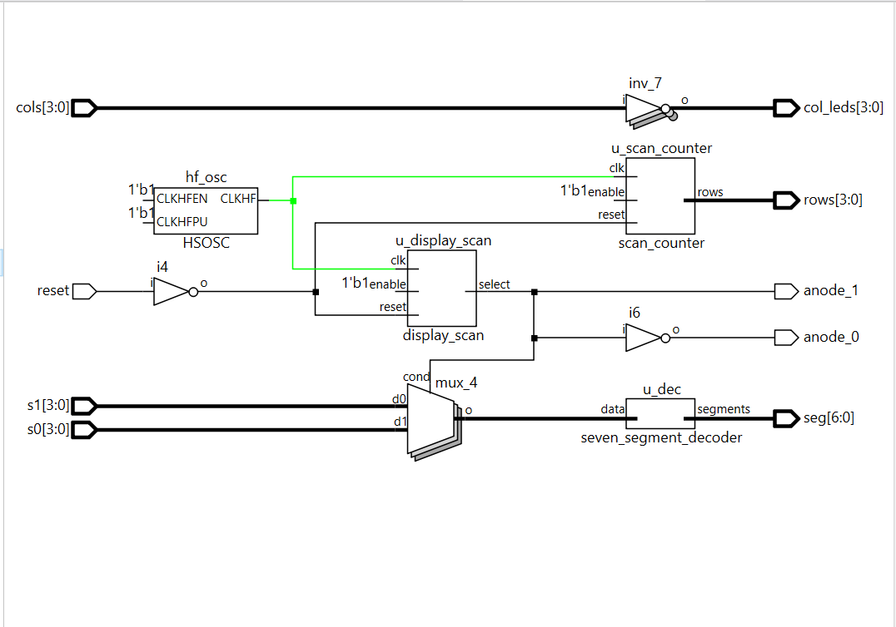
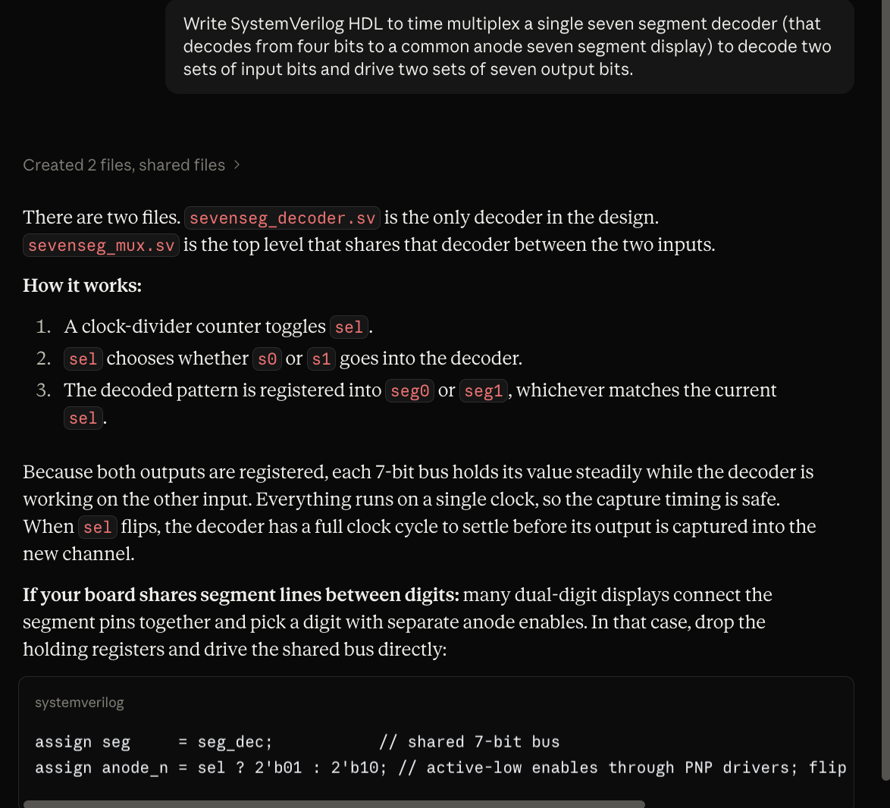
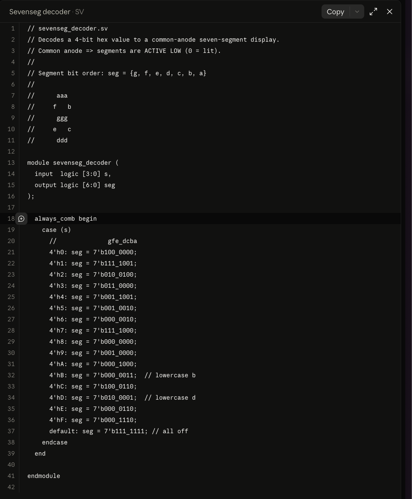
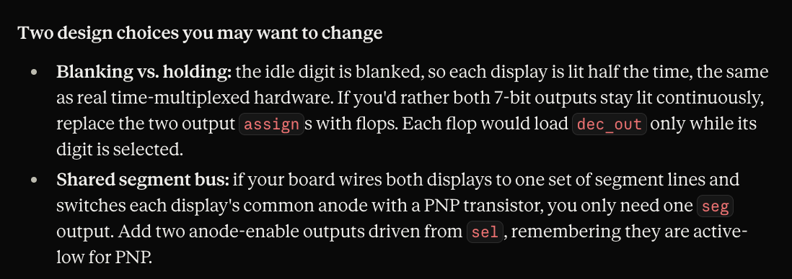
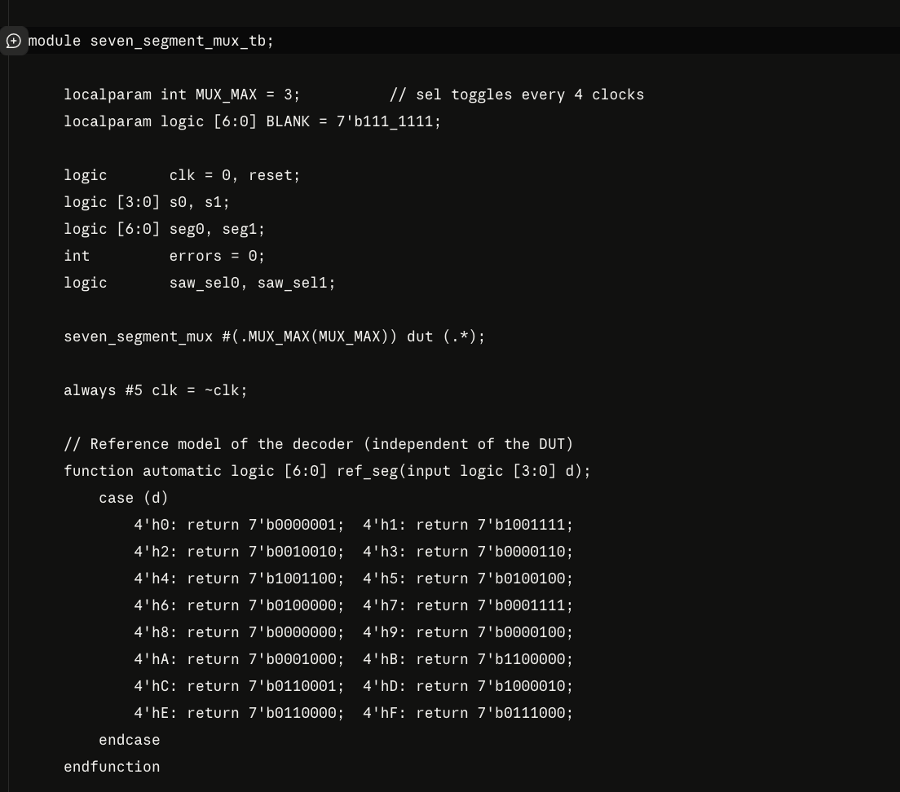

## Introduction:
Lab 2 built on the Lab 1 development board with two extensions: driving *two* seven-segment displays from a single shared set of seven segment lines via time-multiplexing, and scanning a 4x4 matrix keypad with the column reads echoed back onto LEDs. Both extensions push past what the FPGA's I/O drivers can do directly, so the design also required the use of external transistors: 2N3906 PNPs to source the current the anodes each respective seven segment display needed, and four 2N3904 NPNs configured as open-drain drivers on the keypad rows so that multiple simultaneous key presses cannot short row lines together.

## Design and Testing Methodology:
::: {.callout-note}
The design was decomposed into four modules: "seven_segment_decoder.sv" (recycledfrom Lab 1), a new "display_scan.sv" counter that drives the digit-select signal for the 2:1 mux, a new "scan_counter.sv" non-canonical FSM that rotates a one-hot-row pattern across the keypad, and the top-level "lab2_hm.sv" that wires them all together, and provides the anode-drive and column-echo combinational logic.
:::

- "seven_segment_decoder.sv" — combinational 4-bit → active-low 7-segment decoder, unchanged from Lab 1 and instantiated *once* at the top level, time-shared between the two digits.
- "display_scan.sv" — 15-bit counter with parameters "bit_number" and "max_count". At 48 MHz with "max_count = 23_999", the output "select" toggles every 500 µs, giving each digit a 1 kHz refresh rate — well above the human flicker threshold of 60Hz.
- "scan_counter.sv" — non-canonical FSM: a 24-bit prescaler feeding a 2-bit state register whose combinational output logic maps state → "rows[3:0]" one-hot. With "max_count = 11_999_999", the state advances every 250 ms, so each of the four row patterns ('1000', '0100', '0010', '0001') is asserted for a quarter-second and each row line toggles at 2 Hz.
- "lab2_hm.sv" — top level. Instantiates HSOSC, both counters, and the decoder; contains the 2:1 hex mux, the anode selection, and the column-LED echo.

::: {.callout-note}
Each new module has its own testbench that exercises reset, enable, and every output transition with assert statements. Modules reused from Lab 1 were not re-simulated; their existing testbenches remain the source of truth.
:::

### Technical Documentation:
The source code for the project can be found in the `/labs/lab2/fpga/radiant project` directory of the associated [GitHub repository](https://github.com/hlmurphy/e155-portfolio).

### Block Diagram
{#fig-block width=80%}

The top module wires seven elements together: the on-chip HSOSC (clock source shared by both counters), the display multiplexing counter "u_display_scan", the keypad-row scanning counter "u_scan_counter", the reused decoder "u_dec", the 2:1 hex mux driven by "select", the two anode assigns, and the "col_leds = ~cols" echo.

![Lab 2 hardware schematic: two 2N3906 PNP anode drivers with 470 Ω base resistors sourcing current for the two display common anodes; four 2N3904 NPN row drivers configured as open-drain outputs on the keypad rows; 150 Ω current-limiting resistors on each of the seven shared segment lines (carried over from Lab 1); the 4x4 matrix keypad with 1 kΩ column pull-ups to +3.3 V; SW6 DIP switches for "s0[3:0]" and SW7 positions 1-4 (MCU-bridged) for "s1[3:0]"; reset push button with FPGA internal 100 kΩ pull-up.](images/schematic2.png){#fig-schematic width=80%}

::: {.callout-tip title="Schematic Notation"}
FPGA GPIO pins numbers are highlited in green, where corresponsdign signal names notated in white above their respective wires.
:::

## Calculations

### Segment current-limiting resistors
Reused from Lab 1: with a forward voltage of ~2.0 V and target current of ~7 mA per lit segment, "R = (3.3 - 2.0) / 0.007 ≈ 185 Ω". The 150 Ω resistors from Lab 1 remain in place and pass approximately 8.7 mA per segment.

### PNP anode-driver base resistor (2N3906)
{#fig-pnp-calcs width=60%}

## Results and Discussion

### Scan_Counter Simulation

All four row-scan states cycled through, reset-from-cold-start and mid-cycle reset behavior verified, enable-freeze verified. Six self-checking `assert` statements passed.

{#fig-scan-wave}

{#fig-scan-console}

### Top Module Simulation

The top-level testbench tests, reset through the top level, both directions of the display multiplexer — verifying "anode_0"/"anode_1" along with whether "seg" decodes the correct hex source, and the column-echo LED logic across three keypad-input patterns. All assertions passed.

{#fig-top-mux}

{#fig-top-cols}

{#fig-top-console}

### On-Board Verification
{#fig-onboard width=50%}

## Summary & Conclusion

The design meets the functional requirements of Lab 2: two independent 4-bit hex inputs are multiplexed onto a shared seven-segment decoder at 1 kHz per digit, the keypad matrix is scanned at 4 Hz per row using a non-canonical FSM (prescaler + 2-bit state + combinational output logic), and the column reads are echoed on LEDs.

## AI Prototype Summary

Prompting Conversation

**Prompt:**

**Output code:**

**Prompt:**

**Output code:**

### Reflection
For the Lab 2 AI prototype, I found that the Verilog generated followed a lot of the same structure for implementing communicating FSMs as discussed in lecture. For these particular prompts, especially the second (where context files of my own code were provided), I found the code the model generated was noticeably more useful than in Lab 1, mainly because of its legibility. The structure of the modules and the flow of signals made much more sense to me compared to the module generated in the previous lab's prototyping session, which in turn made it more difficult to troubleshoot during the synthesis and compilation phases (as previously mentioned).

### Hours spent
- Assembly and Wire Routing/Pin Assignments: 10h
- Verilog design and synthesis: 5h
- QuestaSim setup and simulation debugging: 4h
- Report writeup, block diagram, and schematic: 8h
- **Total: 27 hours**
