## Introduction:
Lab 3 extends the Lab 2 hardware into a full interactive keypad interface: the FPGA scans a 4x4 matrix keypad, decodes each keypress into a 4-bit hex value, debounces mechanical contact noise, and displays the two most recently accepted keys on the dual seven-segment display multiplexed from Lab 2. The design emphasizes handling of asynchronous inputs, mechanical bounce, and multi-key ambiguity.

## Design and Testing Methodology:
::: {.callout-note}
The design breaks down into nine modules: two synchronizers ("cols_sync.sv" and "reset_sync.sv") for the async column and reset inputs, a non-canonical FSM "scan_counter.sv" that drives the one-hot row scan and generates two timing pulses ("sample_ok" and "end_of_scan"), a combinational "key_encoder.sv" that decodes the currently scanned row + column pattern into a hex value, "debouncer.sv" which accumulates per-full-scan observations and requires N_STABLE=3 consecutive matching full scans before accepting a keypress, "display_register.sv" which stores the last two accepted hex values, "display_scan.sv" and "seven_segment_decoder.sv" recycled from Labs 2 and 1 respectively, and the top-level "lab3_hm.sv" that wires them all together.
:::

- **"cols_sync.sv"** and **"reset_sync.sv"** — 2-flop metastability synchronizers for the asynchronous keypad column and reset button inputs.
- **"scan_counter.sv"** — non-canonical FSM: a parameterized counter feeds a 2-bit state register whose combinational output logic maps state → one-hot row drive. With "max_count = 47_999" at 48 MHz, each row is asserted for ~1 ms (~4 ms per full 4-row sweep), giving each column line ample time to settle through its RC pull-up. The module "sample_ok" signal once per state (at the end of the settled window) and a "end_of_scan" signal once per full scan.
- **"key_encoder.sv"** — combinational lookup that combines the currently active row (one-hot from the scan counter) with the synchronized column readback (active-low, inverted internally to active-high) into a hex value + one-hot validity check.
- **"debouncer.sv"** — accumulator across states 00/01/10 attaches any valid press captured at "sample_ok"; the mux at "end_of_scan" folds in state 11's live press. The evaluator then requires "N_STABLE=3" matching sweeps before pulsing "new_keypress" and updating "key_stable". Includes multi-key rejection logic ("multi_press_seen" + combinational "multi_this_cycle") so that pressing two keys on different rows is treated as invalid rather than attaching whichever row was scanned last.
- **"display_register.sv"** — 2-deep shift register that loads the newly stable key on each "new_keypress" pulse, shifting the prior value into the "previous_number" slot for display.
- **"display_scan.sv"** and **"seven_segment_decoder.sv"** — reused from prior labs, unchanged.
- **"lab3_hm.sv"** — top level. Instantiates all submodules plus the HSOSC, and provides only board-level combinational assigns.

::: {.callout-note}
Each new module has its own self-checking testbench that exercises reset, key state transitions, timing pulses, and interconnections with assert statements. The top-level testbench simulates a full keypress. Modules reused from Lab 1/2 were not re-simulated; their existing testbenches remain the source of truth.
:::

### Debouncing Strategy
The debouncer runs a "check per full scan" filter: on each "end_of_scan" pulse, the module compares the current full scan's result (valid + hex value) against the previous scan's result. If they match, an internal "match_counter" increments; if not, the counter resets and the new result becomes the reference. Once "N_STABLE=3" matching full scan have accumulated, the value is accepted and "new_keypress" pulses for one cycle. This filters the mechanical bounce experienced by the keys. 

### Multi-key Rejection Strategy 
The encoder's one-hot column check already rejects two keys pressed on the same row (both column bits set → key_valid=0). Two keys on **different** rows each produce a legitimate single-hot column on their own row's scan, so we a "multi_press_seen" flag (set on any second valid capture within a sweep) plus a combinational catch for the "end_of_scan" cycle (where "sample_ok"'s else-if branch cannot fire). This forces the entire full scan result to "no press" whenever two rows show valid captures.

### Technical Documentation:
The source code for the project can be found in the `/labs/lab3/fpga/radiant/modules` directory of the associated [GitHub repository](https://github.com/hlmurphy/e155-portfolio).

### Block Diagrams
{#fig-top-block width=90%}

![scan_counter internal block diagram — non-canonical FSM: 16-bit counter increments while enabled, 2-bit state register advances when count == max_count. Combinational output logic maps state → one-hot rows[3:0]. Two combinational timing pulses (sample_ok, end_of_scan) are decoded from state and count.](images/scan_block.png){#fig-scan-block width=80%}

### Schematic
The Lab 3 breadboard circuit is unchanged from Lab 2: two 2N3906 PNP anode drivers for the dual seven-segment display, four 2N3904 NPN open-drain drivers for the keypad rows, 150 Ω current-limiting resistors on each of the seven shared segment lines, the 4x4 matrix keypad with 1 kΩ column pull-ups to +3.3 V, and a reset push button using the FPGA's internal ~100 kΩ pull-up. No new off-board components were added for Lab 3. 

::: {.callout-note}
DIP switch connections for S0 and S1 data signals were removed given the change in input to keypad rows. 
::: 

## Results and Discussion

### scan_counter Simulation

All four row-scan states cycled through, cold-start reset and mid-cycle reset behavior verified, enable-freeze verified, and both timing pulses ("sample_ok" firing once per state at count=max, "end_of_scan" firing only during state 11) verified at the correct sample points. All self-checking assertions passed.

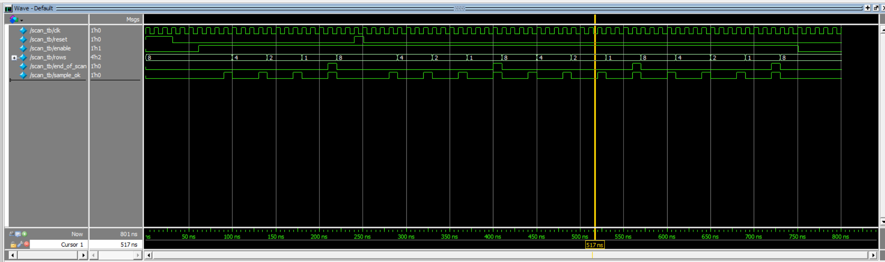{#fig-scan-wave}

{#fig-scan-console}

### cols_sync Simulation

Verifies that the 2-flop column synchronizer correctly propagates both a keypress transition (cols_in = 4'b1110, one key pressed) and a release transition (cols_in = 4'b1111) within exactly two clock cycles. In addition to that, also confirming that reset clears both flops to zero.

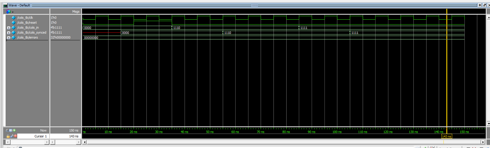{#fig-cols-wave}

{#fig-cols-console}

### reset_sync Simulation

Much like cols_sync, the simulation verifies that a raw reset assertion and deassertion each propagate through the 2-flop synchronizer within two clock cycles, so the internal reset_synced signal can be safely distributed to every register in the design.

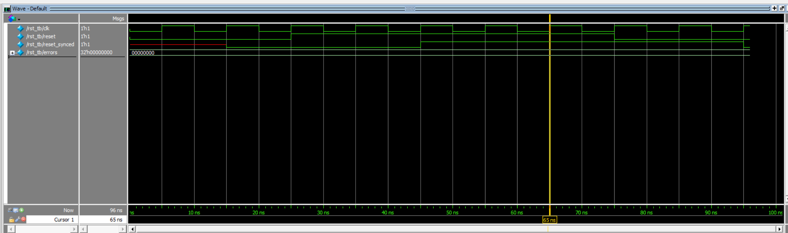{#fig-rst-wave}

{#fig-rst-console}

### key_encoder Simulation

Test of all 16 valid {row_active, cols_pressed} combinations mapping to their expected hex values, plus 4 invalid patterns (no press, two-column press, three-column press, single valid press on a different row) verifying that "key_valid" correctly distinguishes one-hot column patterns from noise.

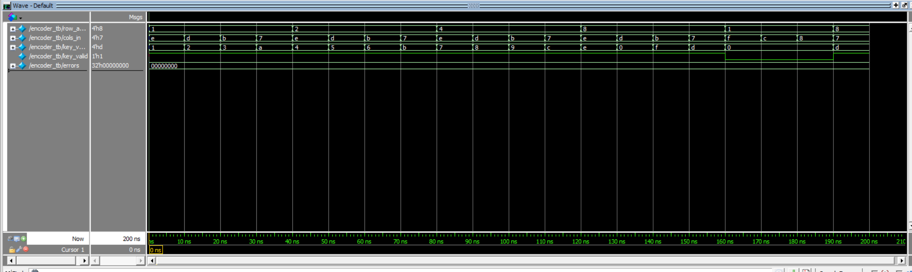{#fig-encoder-wave}

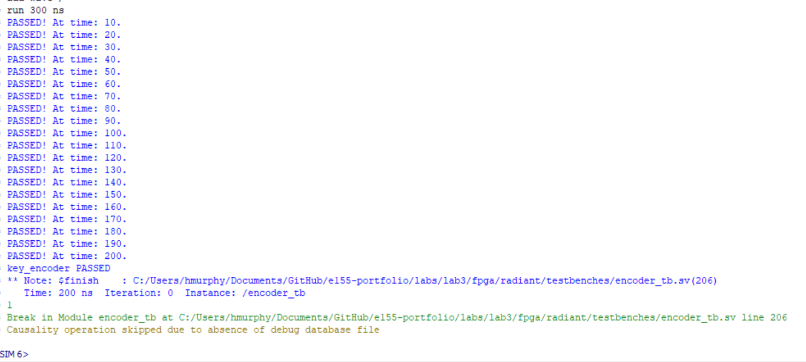{#fig-encoder-console}

### debouncer Simulation

Two blocks: (1) a stable press of key '5' held across 4 scans sets "key_stable = 4'h5" and pulses "new_keypress"; (2) a bouncy input alternating "key_valid=1/0/1/0" while "key_value" stays at 4'h5 (simulating mechanical contact chatter) is correctly rejected via "key_stable" staying at 0 and no "new_keypress" pulse firing.

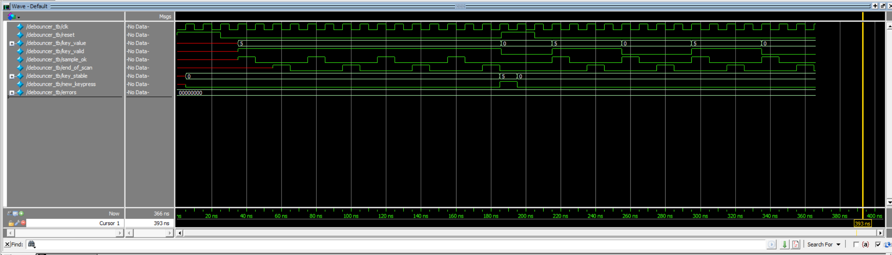{#fig-deb-wave}

{#fig-deb-console}

### display_register Simulation

Four blocks: reset defaults, first key load '5' to current_number, shift + load 'A' to current_number with 5 going to previous_number, and a hold check new_keypress low leaving both registers unchanged even though new_key changes.

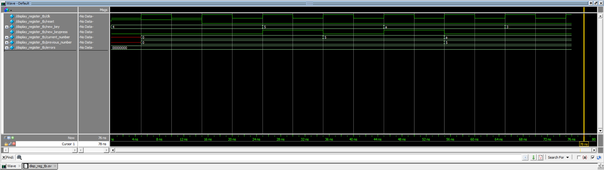{#fig-dr-wave}

{#fig-dr-console}

### Top Module Simulation

The top-level testbench exercises the full pipeline: reset propagates through the 2-flop reset synchronizer, then a keypress drives the "cols" input. After 80 clock cycles of settled contact, "dut.current_number" is verified to equal "4'h1" — proving that the full chain (scan_counter → cols_sync → key_encoder → debouncer → display_register) correctly registers a single keypress end-to-end.

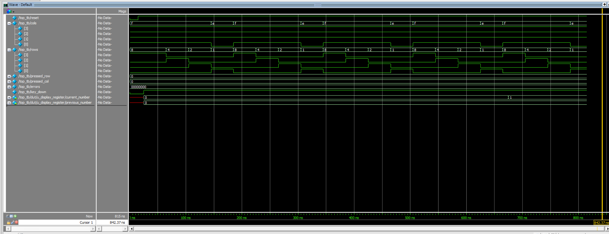{#fig-top-wave}

{#fig-top-console}

### On-Board Verification
The programmed UPduino correctly decoded every one of the 16 keypad keys and displayed each as it was pressed, shifting previously accepted keys into the "previous_number" position. Mechanical bounce was filtered without visible display glitches, and the multi-key excellence case behaved as specified: pressing a second key while a first was held caused the display to hold on the first key; releasing either key allowed the remaining single-key press to register normally.

## Summary & Conclusion

The design meets every functional requirement of Lab 3: the 4x4 keypad is fully scanned via a non-canonical FSM, async column and reset inputs are protected by dedicated 2-flop synchronizers, mechanical bounce is filtered through a per-full scan result accumulator requiring N_STABLE=3 matches, the two most recently accepted hex keys are displayed on the time-multiplexed dual seven-segment display, and every FF is edge-triggered with no inferred latches.

::: {.callout-tip title="Compliance"}
This submission meets every Proficiency requirement in the Lab 3 spec. 
:::

## AI Prototype Summary

Prompting Conversation

**Error Prompting & Output 1st:**

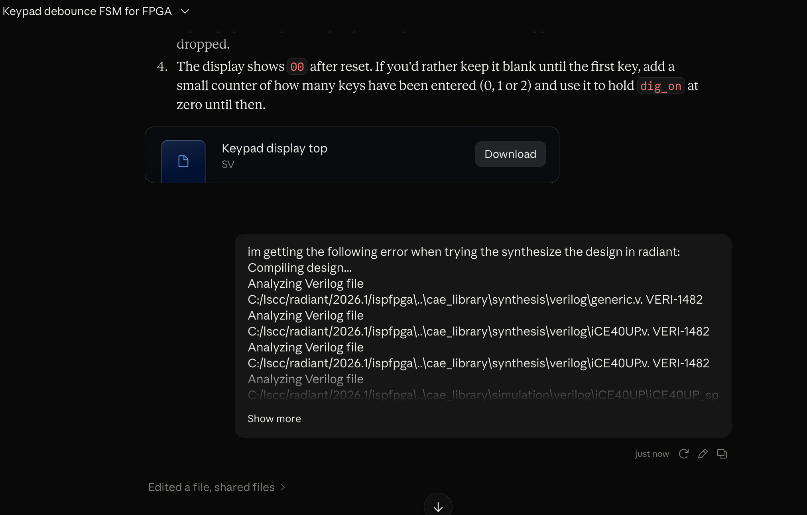

**Error Prompting and Output 2nd:**

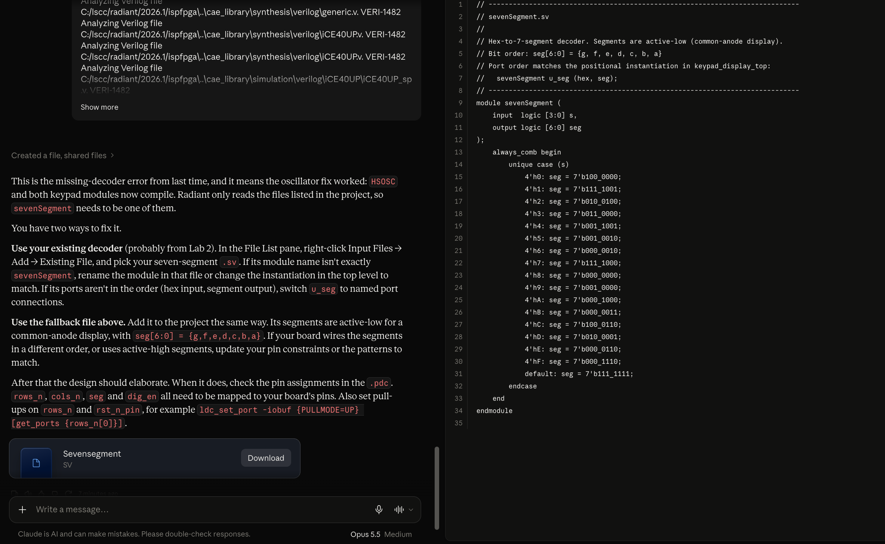

**Successful design synthesis for modular approach:**

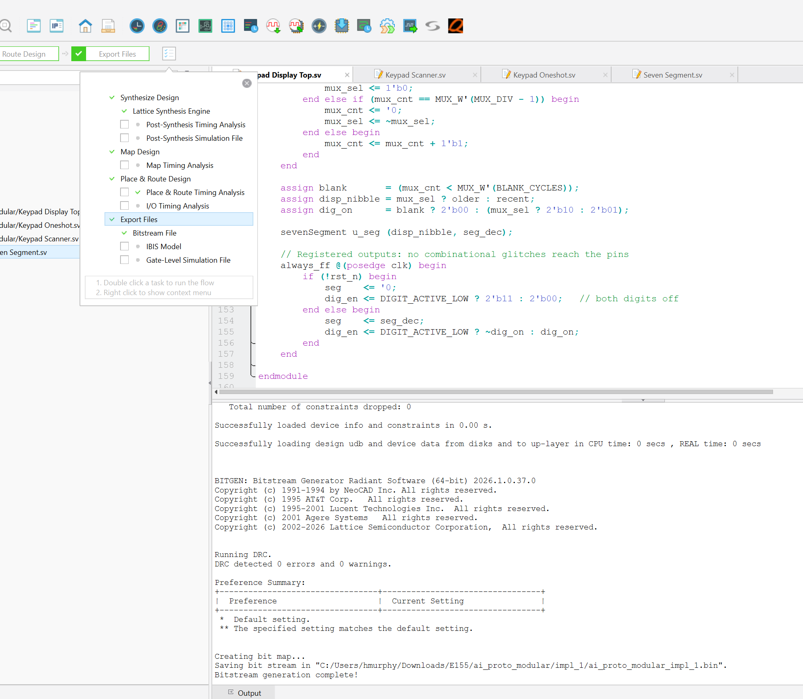

### Reflection
For Lab 3's AI prototype I found the modular approach to be less succesful compared to the monolithic prompt given. It just so happened that with the design generated from the singular monolitc prompt, radiant gave 0 zero error messages upon initial synthesis.  

### Hours spent
- Verilog design and synthesis: 14h
- Debugging on hardware (ghost-capture and multi-key issues): 8h
- Testbench development and simulation: 10h
- Report writeup, block diagrams, and documentation: 7h
- **Total: 39 hours**
