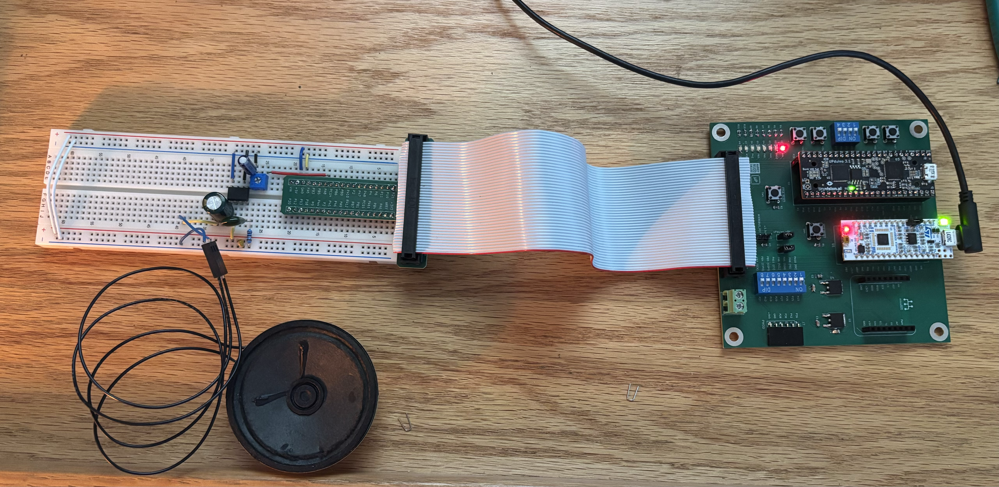
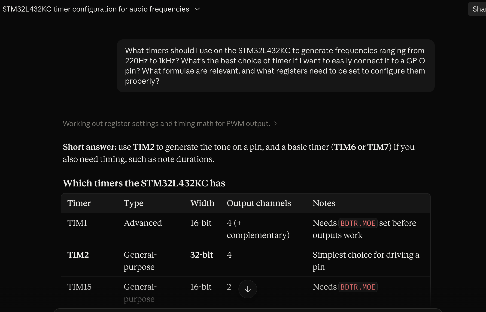
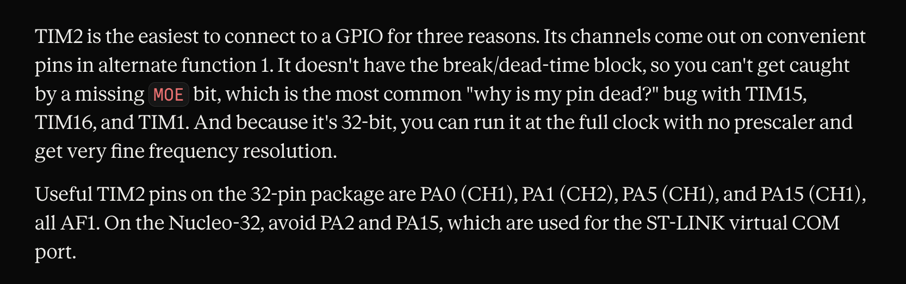

## Introduction

Lab 4 uses the Nucleo-L432KC's STM32L432KC MCU to synthesize music by toggling a GPIO pin (PA8) at note-frequency rates, then amplifying the resulting square wave through an LM386 audio amplifier into an 8Ω speaker. The design constraint that shapes the entire lab is that all peripheral register access must be written by hand from the reference manual — i.e. no CMSIS headers. For this design, timer TIM6 drives the pitch tick and the CPU polls its update flag to toggle PA8 in software; the LM386's Fig. 9.1 gain-of-20 circuit (from the datasheet) conditions the signal into the speaker.

## Design and Testing Methodology

::: {.callout-note}
The design breaks into three C-level components in 'main.c' — a peripheral register layer ('GPIO_TypeDef' + 'BASIC_TIM_TypeDef' structs mapped onto the datasheet's register offsets), a pair of init functions ('gpio_init_pa8', 'tim6_init') that gate the peripheral clocks in RCC and configure PA8 for output, and a note engine ('play_tone', 'play_rest', 'play_note', 'play_song') that plays the score array and produces the audio waveform. The Für Elise score is supplied as 'const int notes[][2]' in 'lab4_starter.c'.
:::

- **Register layer** — 'GPIO_TypeDef' and 'BASIC_TIM_TypeDef' are 'typedef struct's of 'volatile uint32_t' fields laid out to exactly mirror the register offsets in the Reference Manual. Reserved slots at offsets 0x08, 0x18, 0x1C, 0x20 preserve TIM6's field alignment. Peripheral base pointers are set during compilation via '#define GPIOA ((GPIO_TypeDef *) 0x48000000UL)' — similarily for TIM6. Two RCC registers — 'RCC_AHB2ENR' (0x4C) and 'RCC_APB1ENR1' (0x58) — are accessed via direct-address. 
- **'gpio_init_pa8'** — sets GPIOAEN (bit 0 of 'RCC_AHB2ENR'), clears MODER[17:16], then sets MODER bit 16 to place PA8 in general-purpose output mode. OTYPER (push-pull) and PUPDR (no-pull) are left at their reset defaults, (which already are in their desired configuration).
- **'tim6_init'** — sets TIM6EN (bit 4 of 'RCC_APB1ENR1'). TIM6's CR1 is left at its reset value of zero so the counter starts stopped; each call to 'play_tone' starts and stops it explicitly.
- **'play_tone(freq_hz, duration_ms)'** — computes 'ARR = 4_000_000 / (2·freq_hz) - 1' using the reset-default MSI 4 MHz clk feeding the APB1 timer clock, programs PSC=0 and ARR, pulses EGR.UG to load the shadow registers, clears the resulting spurious UIF, and enables CR1.CEN. It then spin-polls SR.UIF, clears it, and XORs PA8's ODR bit — repeating for exactly '2·freq_hz·duration_ms/1000' toggles before disabling CR1.CEN.
- **'play_rest(ms)'** — a calibrated wait loop for silences (when freq is 0).
- **'play_note(freq, dur)'** — dispatcher that guards the divide-by-zero in 'play_tone' by routing 'freq==0' entries to 'play_rest'.
- **'play_song(song)'** — walks the score array until it hits an entry with duration 0 (the spec's end-of-song marker).

### The 'volatile' requirement

Every register field is declared 'volatile uint32_t' to prevent the compiler from cacheing SR into a CPU register inside the 'while (!(TIM6->SR & 1)) {}' spin-loop and never re-reading the actual memory location, which would result in a hang.

### Frequency math

At the MSI 4 MHz reset clock, the timer overflow period is '(PSC+1)·(ARR+1) / 4_000_000' seconds. Since we want the pin to toggle at '2·f_note' (two half-periods per full waveform cycle), the required '(PSC+1)·(ARR+1)' product is '4_000_000 / (2·f_note)'. Holding PSC=0 gives the finest resolution:

- Rest (freq = 0) → dispatched to 'play_rest', not 'play_tone', avoiding division by zero.

### Technical Documentation

The source code for the project can be found in the '/labs/lab4/mcu/' directory of the associated [GitHub repository](https://github.com/hlmurphy/e155-portfolio).

## Documentation

### Schematic

{#fig-schematic width=80%}

### Register Map Summary

::: {.callout-note title="Register offsets used (from RM0394)"}

| Peripheral    | Base      | Register | Offset | Purpose                   |
|---            |---        |   ---     | ---  |            ---             |
| GPIOA (AHB2)  | 0x48000000| MODER     | 0x00 | PA8 mode select            |
|               |           | ODR       | 0x14 | PA8 output level           |
| RCC (AHB1)    | 0x40021000| AHB2ENR   | 0x4C | GPIOA clock enable (bit 0) |
|               |           | APB1ENR1  | 0x58 | TIM6 clock enable (bit 4)  |
| TIM6 (APB1)   | 0x40001000| CR1       | 0x00 | Counter enable (bit 0)     |
|               |           | SR        | 0x10 | Update flag UIF (bit 0)    |
|               |           | EGR       | 0x14 | Update generation UG (bit 0) |
|               |           | PSC       | 0x28 | Prescaler                  |
|               |           | ARR       | 0x2C | Auto-reload value          |
:::

### Frequency and Duration Calculations

The following derivations relate TIM6's register configuration to the produced output frequency and the achievable range of note durations. Each calculation was worked out by hand from the MSI 4 MHz timer clock and the constraints of the 16-bit PSC/ARR registers, and photographed for the writeup.

![Timer configuration → output frequency and duration relationships. Derives f_out = 4,000,000 / [2·(PSC+1)·(ARR+1)] from the TIM6 update-event rate, giving ARR = (2,000,000 / f_out) − 1 with PSC = 0. Companion derivation shows n_toggles = (2·f_out·duration_ms) / 1000, matching the loop-count formula used in 'play_tone'.](images/lab4_calcs1%202.png){#fig-calc-1 width=80%}

{#fig-calc-2 width=80%}

{#fig-calc-3 width=80%} 

{#fig-calc-4 width=80%}

## Results and Discussion

### Audible Playback of Für Elise

With the safety check passed, the 8 Ω speaker was connected in place of the dummy resistor. All 108 entries of the provided 'notes[][2]' array played back cleanly through the speaker. Note frequencies were within the ±[X%] pitch tolerance the timer resolution can produce at MSI 4 MHz; rests (freq = 0) produced correct silences via the 'play_rest' dispatcher; the terminating {0,0} entry cleanly ended playback.

### Excellence: Angry Birds

A second song was transcribed from Ari Pulkkinen and David Schweitzer ‧ 2012 Angry Birds Theme. The opening 3-bar theme was encoded into a second 'const int angry_birds[][2]' array using the same {pitch, duration} format. 'play_song' was refactored to take the score array as an argument, and 'main' alternates between the two songs with a rest between them.

{#fig-breadboard width=80%}

## Summary & Conclusion

The design meets every Proficiency requirement in the Lab 4 spec: the MCU reads a note-and-duration list, generates square waves at the specified pitches, treats freq=0 as rest and dur=0 as termination, and plays the provided Für Elise score audibly through the LM386 → 8 Ω speaker signal chain. All register access is hand-written from RM0394 with no CMSIS headers, and every accessed register field is declared 'volatile uint32_t'. Excellence-tier work adds a hand-transcribed second song (Mozart's Rondo Alla Turca).

::: {.callout-tip title="Compliance"}
This submission meets every Proficiency requirement in the Lab 4 spec and includes the optional custom-music extension for Excellence credit.
:::

## AI Prototype Summary

Prompting Conversation

**[Initial Response]:**

**[Reasoning]:**

### Reflection

Upon prompting the LLM two path we considered. The first (the path this lab followed) uses a basic timer (TIM6) to fire periodic update events at 2·f_note, with the CPU polling TIM6→SR.UIF and toggling PA8's ODR bit in software. The second (which AI first provided) used a general-purpose timer (TIM2) in output-compare toggle mode, with the timer channel routed to a pin via an alternate function so the hardware flips the pin autonomously. The lab elected to move forwared using the basic TIM6 timer because: it met the lab spec's  "toggle a GPIO pin", and TIM6 has a smaller register footprint since its role is exactly "time base generation" per the datasheet. A good point the AI made was that if the CPU was needed to remain freet o do other tasks during playback, the route of utilizing both TIM2 and an alternate function would be preferable. 

### Hours spent

- Manual search through Reference Manuals/Datasheets/User Manuals: 4h
- LM386 breadboard build and safety verification: 1h
- C code development (register structs, init, play_tone, play_song): 5h
- Debugging on hardware (timing calibration, tone tuning): 1h
- Angry Birds transcription (excellence tier): 2h
- Report writeup, schematic drawing, and documentation: 5h
- **Total:  18 hours**
